# Helsinki Hoods – Where to Start a Restaurant in Helsinki?
## Applied Data Science Capstone Project – The Battle of Neighborhoods
### Project Report
 
Simo Sahla

### 1. Introduction
If I were an entrepreneur planning to start a new restaurant in Helsinki, which neighborhood would be a good choice for location? 

I would naturally want to choose a neighborhood where there are lots of potential customers. On the other hand, I wouldn't want to pick an area that's already saturated with competing restaurants. In other words, I'd want to find a neighborhood with a low restaurants-to-citizens ratio.

In this project I'm trying to calculate this ratio for different Helsinki neighborhoods using Foursquare venue data and visualize it in a way that can give insights on business opportunities in different parts of Helsinki. I'm using restaurants as an example, but the same can be done for different types of venues.

### 2. Data
To achieve my goal I will be using the following data sources: 
- The Foursquare API will give me data for **numbers of venues** in different parts of Helsinki.
- The city of Helsinki has made available **geodata for neighborhoods of Helsinki**. With this I can plot the neighborhoods on the map as polygons.
- Also, **population numbers of each neighborhood** are available from the city of Helsinki and can be used to calculate the ratio of venues per capita.

### 3. Methodology
#### 3.1. Acquiring and processing geographic and demographic data

To gather the data I need for the visualization, I started by fetching geographical data on Helsinki neighborhoods, provided by the Helsinki city open data service. I stored this data in a GeoDataFrame.

This dataset contains the borders of neighborhoods as polygons. It turned out the coordinates were presented in a different projection than what Foursquare uses, so they had to be converted. Luckily, that was easy to do using GeoPandas.

In addition to border polygons, I used a GeoPandas function to calculate the centroid coordinates of each neighborhood. I would use them later when getting venue data from Foursquare.

The data I had now looked like this:

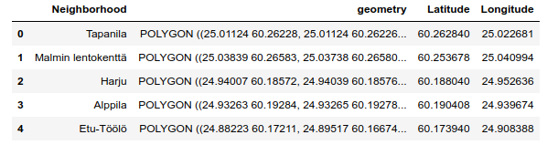

The next step was to get population figures for each neighborhood and combine them into my dataset. This data was available from the city of Helsinki as an Excel spreadsheet. I converted it to a Pandas dataframe with the read_excel function, and after some cleaning I had a dataframe looking like this:

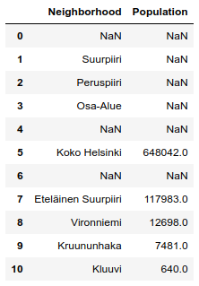

(As can be seen, the data has NaNs and other extraneous values, but they will be discarded in the next step.)

Now I merged the values of the two dataset into a new one:

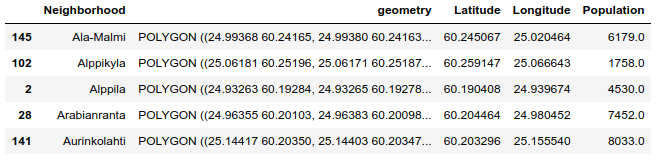

#### 3.2. Getting venues from Foursquare

Ideally, I would have liked to know the exact number of venues within each neighborhood's boundaries. However, this doesn't seem to be possible with the Foursquare API. Instead, I decided to  request from Foursquare venues within a 2,000 meter radius of the centroid of each neighborhood. 

This is obviously not an ideal solution. The neighborhoods vary very much in size and shape, and therefore the 2,000 meter radius may leave out part of the neighborhood. On the other hand, in neighborhoods with smaller areas, it will return venues from neighboring neighborhoods. Also the geographical centroid point of a neighborhood may be in a different place than the demographical center. We must bear these caveats in mind when looking a the results.

To process the results, I wrote a function to go through my neighborhood dataset and for each neighborhood get the number of venues (in a given section, for example "food", "drinks") from Foursquare. The function also calculates the ratio of venues-per-capita based on the population figures and returns a new dataset with ratios added. 

The resulting dataframe looks like this, sorted alphabetically by neighborhood name:

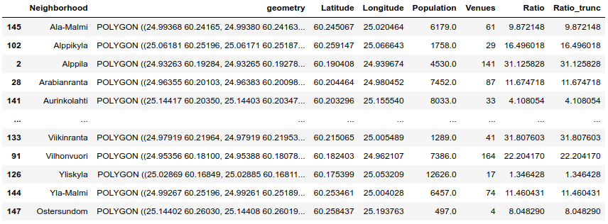

To get more easily readable figures, the ratio is calculated as venues per thousand residents. For example, in the neighborhood of Alppila there are 4,530 (4.53 thousand) residents and 141 venues in the "shops" section. 141 divided by 4.53 is 31.125828, so we see that in Alppila there are approximately 31 shops for every thousand residents.

The _Ratio_trunc_ column is the same as _Ratio_ except that values over the ninth decile are truncated down to the ninth decile. I found this to be useful when creating a choropleth map of the results.

#### 3.4. visualization

I used the Folium library to draw a choropleth map of the results. The neighborhoods are drawn on the map as polygons and colored according to the venues-per-capita ratio calculated. When a neighborhood is clicked, a label is shown with the name of the neighborhood and the calculated ratio. 

Here is an sample of a map drawn by the map function:

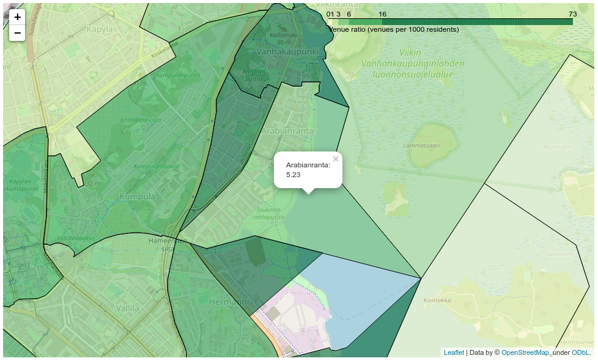

### 4. Results

I used the functions described in the Methodology section to get choropleth maps of venues in different sections (food, drinks, coffee and shops).

Map 1: food
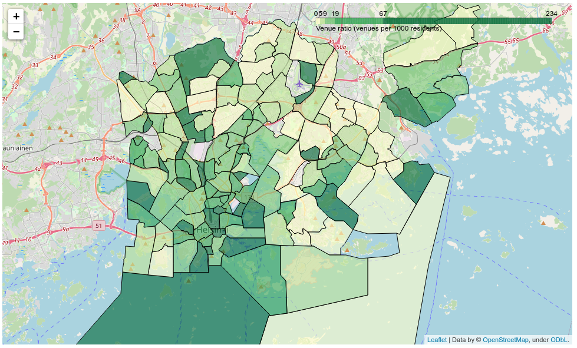
Map 2: drinks
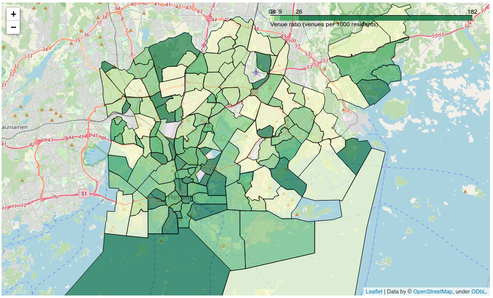
Map 3: coffee
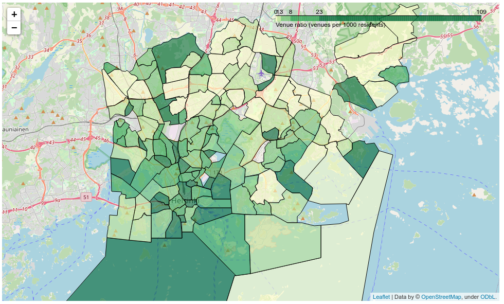
Map 4: shops
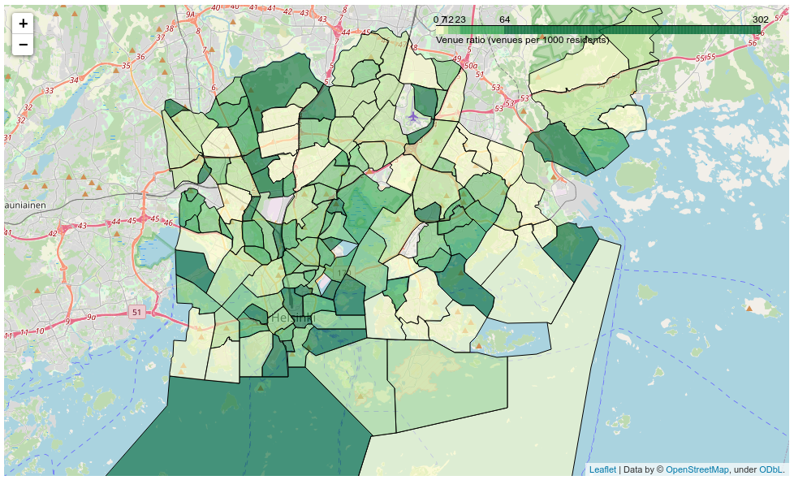

The maps show areas with higher venues-per-residents ratios in darker green and areas with lower ratios in light green. At a glance the maps look similar, with the same areas in darker green, but closer examination reveals differences.

#### 4.1. Observations
From the colors of the neighborhoods observations can be made. To give a couple of examples:

- Keski-Vuosaari, a large residential area, has a low number of 0.79 coffee places per thousand residents. Is this an opportunity for a business?  

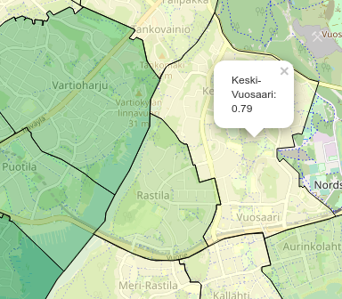

- Arabianranta seems to have a lower number of restaurants per capita than neighboring areas. Maybe a new restaurant could find customers there?

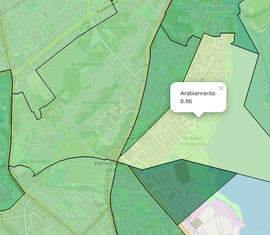

Examining the maps also highlights anomalies and problems in the methodology. The different characteristics of neighborhoods may result in distortions in the ratios and misleading colors in the map. For example: 

- Haltiala, an outdoor recreation area with a population of 9 (nine), has a very high restaurants-to-residents ratio, because six restaurants fall within the 2,000 meter radius from it's centroid.

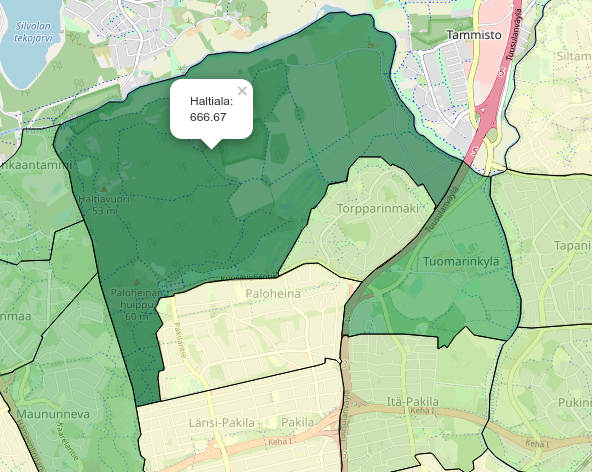

- Roihupelto seems to be overly saturated with food joints. This is not necessarily true, because Roihupelto is an industrial area; it has very few residents, but because of workplaces situated there, there is demand for restaurants.

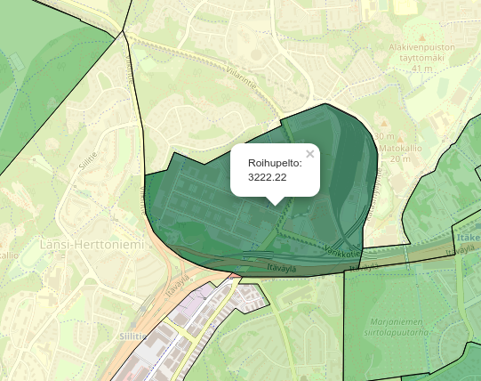

### 5. Discussion

The visualizations I have created may give basic insights about the saturation of restaurants and other venues in different parts of the city. However, it is clear that there are weak points in this approach:

- As mentioned earlier, getting venue figures from a circular area of fixed size gives erroneous results, as the neighborhoods are not circular nor fixed in size.
- The number of residents does not equal the number of potential customers, as many customers are eat near their workplace, not their home.

This visualization tool can only be seen as a preliminary step. To create a truly useful tool for entrepreneurs, the methodology should be refined, and other data sources should be utilized alongside the ones used now.

### 6. Conclusion

Data visualization can be used as a valuable tool when examining business opportunities – and it can be made with tools and data sources that are openly and freely available. But when looking at a visualization, one must bear in mind that it's always a simplification showing only certain aspects of the real world and possibly omitting others that are as important. 
